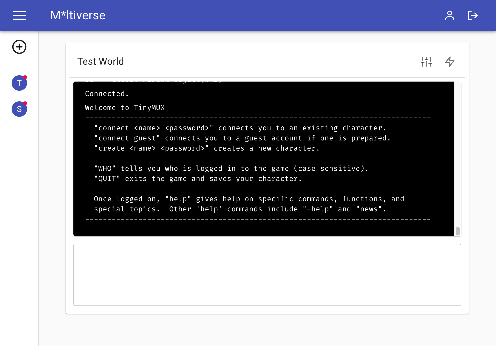

# M*ltiverse

This is a very, very rough initial version of a side project with zero prospects for profitability.  It should not be assumed to be functional in any way and should not be run on an exposed server, especially not with the default environment variables.  Any user of this code does so at their own risk.

What it is *eventually* going to be is a mobile-friendly web-based client for telnet text games.  Yes, I am aware that telnet is terrible, but most of these games are still running servers that were primarily built in the 1990s.

M*ltiverse is being built with React, Express, Apollo, Material UI, and a lot of apologies to my future self.

